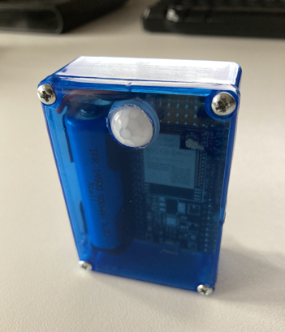

## Pet Alert
### ESP32 based motion detector - Informs you when your pet is waiting at the door to be let in.  

The goal was to create a small portable motion detector that runs on battery power only and does not require an external power source. When motion is detected, a push notification is to be sent to the smartphone via WLAN. For the push notification Telegram is used, which means no additional APP is needed, except Telegram of course. The challenge was to consume little power in order to extend the operating time of the motion detector in battery mode. Below you can see a prototype without sun shield and LED.  

  

Sure, there are several use cases for which a portable motion detector can be used. But as the project name suggests, we use it for our pet, more precisely for our cat. When our cat comes back from stray, she often stands unnoticed in front of the front door for hours, wanting to be let in. In the winter, she's usually pretty peeved when we finally let her in. A cat door would be a possible solution, but we opted for the PetAlert solution, which of course also works for dogs.  

How it works
------------
The motion detector should be positioned near the front door, where your pet usually stays when it wants to be let in, within range of the WiFi signal. If no motion is detected, the device is in deep sleep mode, no active WLAN connection exists. When motion is detected, the device is awakened from deep sleep mode and monitors further motion for 30 seconds in active mode. If nothing is detected, the device automatically switches back to deep sleep mode. However, if 3 more movements are registered within the 30 seconds, a WLAN connection is established and a predefined URL is invoked. In our case, the Telegram API for push notifications. After that, the device switches to deep sleep mode for 5 minutes, during which time no further movements are detected. All mentioned parameters like time, number of movements as well as the URL are configurable via web interface.  

  

Web interface
-------------
There are 2 configuration modes for accessing the web interface.  

**Mode A** the device acts as a WLAN access point.  
**Mode B** the device acts as a WLAN client.  

**Mode A**  
For the very first time, the device must be placed in **mode A** in order to access the web interface. To do this, set jumper J1 and press the RST/EN button on the ESP32. The flashing LED1 indicates that **mode A** is active. The mode remains active for 5 minutes. A SSID with the initial letters PETxxxx should be visible. Now you can connect to this access point with your WLAN device. The password is "petalert". To open the web interface, simply enter http://10.100.10.1 in the address bar of your browser. You should remember the SSID, which is also the hostname of the device. Helpful in **mode B**, where the device is assigned a dynamic IP address. In **mode A** you can enter your WLAN data and assign user and password for the web interface, do not forget to save. The remaining parameters should be added in **mode B**.  

**Mode B**  
If all data are correct, you can switch to **mode B**, just remove jumper J1 and press the RST/EN button on the ESP32. The LED1 will light up constantly. If you don't know your IP address, use the hostname. Now you need to enter the previously assigned credentials for accessing the web interface (user and password) to set up the remaining parameters.  

**Alert URL** in this input field a URL can be entered, which will be called in case of an alert. The placeholders *$token$* and *$text$* are replaced by the corresponding input fields **Alert Text** and **Token**. If you want to use Telegram as a notification service, you can keep the URL `https://api.telegram.org/bot$token$/sendMessage?chat_id=1234567&text=$text$` only the chat_id has to be changed. Instructions on how to create your personal Telegram token are explained in detail here: https://core.telegram.org/bots#how-do-i-create-a-bot. In a nutshell, you need to create a bot with your Telegram app, which will give you your token. Then you need to create a group and add the bot to the group. The only other thing you need is the chat_id, which is the ID of your group. I've explained the details here in section 4: https://github.com/seizu/siteping#readme  

**Alert Text** is the placeholder text for *$text$*. The *$bat$* placeholder is replaced by the current voltage status of the battery.  

**Token** is the placeholder text for *$token$*  

**LED ON/OFF** LED feedback for motion detection.  

**Power OFF/ON** OFF sends the device permanently into deep sleep mode. Keep in mind, to reactivate **Power ON**, the RST/EN button must be pressed to access the web interface.  

The remaining parameters are self-explanatory. It should be mentioned that the value for the **Attention timer** should be set as low as possible. A high value reduces the battery life. For example, if you set the detection counter to 4 and the attention timer to 60 seconds, at worst the device will stay awake for 3 minutes, because each detection resets the **Attention timer**.  

  

Battery and voltage measurement
-------------------------------
The device is powered by a LiFePo4 IFR14500 battery with 600mAh. To increase the operating time of the device, you can also use the bigger brother IFR26650 with 3000mAh. Depending on which ESP32 development board you use, the device consumes too much power even in deep sleep mode due to the USB voltage regulator. There are several solutions to fix this issue. One possibility would be to simply desolder the two chips CP2103 and AMS 1117 with a heat gun after flashing the sketch. The ESP32 Firebeetle board would also be a good option, this board uses a voltage regulator which consumes little power even in deep sleep mode. However, I prefer to desolder the two chips. The battery voltage is measured by a voltage divider with two 100K ohm resistors at GPIO pin 34. The measured value must therefore be multiplied by 2. By using the 600mAh battery and the above mentioned settings at an average outdoor temperature of about 3° Celsius, the device runs for about 1 month. The battery life may vary depending on the settings and the number of notifications sent.

Schematic
---------

Breadboard
----------

Parts
-----
* LED1: LED Red 3mm 2.0~2.4V 20mA
* R1,R5: 10KΩ Resistor
* R2: 47Ω Resistor
* R3,R4: 100KΩ Resistor  
* C1: 10uF/35V Ceramic Capacitor 
* U1: ESP32 WROOM32 DevKit (V4)
* RIP1: AM312 RIP Sensor
* BAT1: 3.2V LiFePo4 IFR 14500 600mAh or IFR26650 3000mAh
* J1: Jumper Pins
* Battery Holder
* 2x Half Breadboards
* Jumper, Jumper Cables
* PCB Prototyp Board 70x50mm
* Plastic case LxWxH 70x50x25mm (Suitable for the small battery 14500)
* Silver wire
* A short piece of PVC pipe ⌀xL 16x20mm to prevent direct sunlight on the AM312.

Tools
-----
* Soldering iron 15W and solder
* Heat gun
* Cutting nife
* Side cutter
* Tweezers
* Forstner drill or wood drill 12mm (Hole for AM312)
* Plastic glue or hot glue gun to stick the sun shield.

Installation
------------
There are two ways to flash your ESP32 with the Pet Alert firmware. The first option is to compile the project and flash it with the development environment, which requires Microsoft Visual Studio Code and the PlatformformIO extension. Option two, you flash the precompiled firmware directly to your ESP32 via script. **Both options require that the USB driver for your particular ESP32 model is installed.**  

To compile the project perform the following steps:
* Download and install Microsoft VS Code https://code.visualstudio.com/
* Download and install Git https://git-scm.com/downloads
* Install PlatformIO Extenstion for VS Code
  * Open VS Code, press Ctrl+Shift+X, in the textfield search for PlatformIO and install the extension. C/C++ IntelliSense (Microsoft) will be installed automatically.
* Clone the Github Pet Alert repository.
  * Press Ctrl+Shift+G and click on "Clone Repository", paste https://github.com/seizu/PetAlert.git into the textfield above and press RETURN. If "Manage Workspace Trust" appears, click on "Trust" to trust the workspace.
  * Choose a target directory and click on "Select as Repository Destination" to download the project files. Click "Open" and click on "Yes, I trust the authors"

* If everything has been installed correctly, a tiny house icon should be visible on the left side of the lower status bar. Right next to it, there is a small check mark (PlatformIO: Build), click on it to build the Pet Alert firmware.
* To flash the firmware connect your ESP32 to your PC using a USB cable and click on the arrow (PlatformIO: Upload) right next to the check mark. 

Video  

