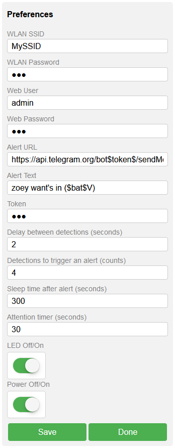

## Pet Alert [](https://github.com/seizu/PetAlert/blob/master/README.md)[](https://github.com/seizu/PetAlert/blob/master/README_de.md)  
### ESP32-basierter Bewegungsmelder - Informiert dich, wenn dein Haustier vor der Tür wartet, um hereingelassen zu werden.  

Ziel war es, einen kleinen, tragbaren Bewegungsmelder zu entwickeln, der nur mit Akku betrieben wird und keine externe Stromquelle benötigt. Wenn eine Bewegung erkannt wird, soll eine Push-Benachrichtigung über WLAN an das Smartphone gesendet werden. Für die Push-Benachrichtigung wird Telegram verwendet, was bedeutet, dass keine zusätzliche App benötigt wird, außer Telegram natürlich. Die Herausforderung bestand darin, wenig Strom zu verbrauchen, um die Betriebszeit des Bewegungsmelders im Akkubetrieb zu verlängern. Unten siehst du einen Prototyp ohne Sonnenschild und LED.

  

Sicher, es gibt mehrere Anwendungsfälle, für die ein tragbarer Bewegungsmelder verwendet werden kann. Aber wie der Projektname schon sagt, verwenden wir ihn für unser Haustier, genauer gesagt für unsere Katze. Wenn unsere Katze vom Streunen zurückkommt, steht sie oft stundenlang unbemerkt vor der Haustür und will hereingelassen werden. Im Winter ist sie meist ziemlich genervt, wenn wir sie endlich hereinlassen. Eine Katzentür wäre eine mögliche Lösung, aber wir haben uns für die PetAlert-Lösung entschieden, die natürlich auch für Hunde funktioniert.  

Wie es funktioniert
------------
Der Bewegungsmelder sollte in der Nähe der Haustür positioniert werden, wo sich dein Haustier normalerweise aufhält wenn es hereingelassen werden möchte. In Reichweite des WiFi-Signals. Wenn keine Bewegung erkannt wird, befindet sich das Gerät im Tiefschlafmodus, es besteht keine aktive WLAN-Verbindung. Wenn eine Bewegung erkannt wird, wird das Gerät aus dem Tiefschlafmodus aufgeweckt und überwacht 30 Sekunden lang weitere Bewegungen im aktiven Modus. Wird nichts erkannt, schaltet das Gerät automatisch in den Tiefschlafmodus zurück. Werden jedoch innerhalb der 30 Sekunden 3 weitere Bewegungen registriert, wird eine WLAN-Verbindung aufgebaut und eine vordefinierte URL aufgerufen. In unserem Fall ist das die Telegram-API für Push-Benachrichtigungen. Danach schaltet das Gerät für 5 Minuten in den Tiefschlafmodus, in dem keine weiteren Bewegungen erkannt werden. Alle genannten Parameter wie Zeit, Anzahl der Bewegungen sowie die URL sind über ein Webinterface konfigurierbar.  

  

Web interface
-------------
Es gibt 2 Konfigurationsmodi für den Zugriff auf die Weboberfläche.  

**Mode A** das Gerät agiert als WLAN Access Point.  
**Mode B** das Gerät agiert als WLAN-Client.  

**Mode A**  
Beim ersten Mal muss das Gerät in den **Modus A** versetzt werden, um auf das Webinterface zugreifen zu können. Setze dazu den Jumper J1 und drücke die RST/EN-Taste am ESP32. Die blinkende LED1 zeigt an, dass **Modus A** aktiv ist. Der Modus bleibt für 5 Minuten aktiv. Es sollte eine SSID mit den Anfangsbuchstaben PET...... zu sehen sein. Nun kannst du dich mit deinem WLAN-Gerät mit diesem Access Point verbinden. Das Passwort lautet "petalert". Um das Webinterface zu öffnen, gib einfach http://10.100.10.1 in die Adresszeile deines Browsers ein. Du solltest dir die SSID merken, die auch der Hostname des Geräts ist. Hilfreich im **Modus B**, wo dem Gerät eine dynamische IP-Adresse zugewiesen wird. In **Modus A** kannst du deine WLAN-Daten eingeben und Benutzer und Passwort für die Weboberfläche vergeben, vergiss nicht zu speichern. Die restlichen Parameter sollten in **Modus B** hinzugefügt werden.

**Mode B**  
Wenn alle Daten korrekt sind, kannst du auf **Modus B** umschalten, indem du den Jumper J1 entfernst und die RST/EN-Taste am ESP32 drückst. Die LED wird konstant leuchten. Der Bewegungsmelder sollte nun eine dynamische IP-Adresse von Ihrem WALN-Router erhalten haben. Wenn du deine IP-Adresse nicht kennst, verwende den Hostnamen für den Zugriff auf das Webinterface (z.B.: http://PET70C312). Jetzt musst du die zuvor vergebenen Zugangsdaten für das Webinterface (Benutzer und Passwort) eingeben, um die restlichen Parameter einzustellen.  

**Alert URL** In diesem Eingabefeld kann eine URL eingegeben werden, die im Falle eines Alerts aufgerufen wird. Die Platzhalter *$token$* und *$text$* werden durch die entsprechenden Eingabefelder **Alert Text** und **Token** ersetzt. Wenn du Telegram als Benachrichtigungsdienst nutzen möchtest, kannst du die URL `https://api.telegram.org/bot$token$/sendMessage?chat_id=1234567&text=$text$` beibehalten, nur die chat_id muss geändert werden. Wie du dein persönliches Telegram-Token erstellst, wird hier im Detail erklärt: https://core.telegram.org/bots#how-do-i-create-a-bot. Kurz gesagt, musst du einen Bot mit deiner Telegram-App erstellen, der dir deinen Token geben wird. Dann musst du eine Gruppe erstellen und den Bot zu dieser Gruppe hinzufügen. Das Einzige, was du noch brauchst, ist die chat_id - die ID deiner Gruppe. Ich habe die Details hier in Abschnitt 4 erklärt: https://github.com/seizu/siteping#readme  

**Alert Text** ist der Platzhaltertext für *$text$*. Der Platzhalter *$bat$* wird durch den aktuellen Spannungsstatus der Batterie ersetzt.  

**Token** ist der Platzhaltertext für *$token$*  

**LED ON/OFF** LED Feedback für die Bewegungserkennung.  

**Power OFF/ON** OFF schaltet das Gerät dauerhaft in den Tiefschlafmodus. Bitte bedenke, dass zur Reaktivierung von **Power ON** die RST/EN-Taste gedrückt werden muss, um ins Webinterface zu gelangen.  

Die übrigen Parameter sind selbsterklärend. Es sollte erwähnt werden, dass der Wert für den **Attention timer** so niedrig wie möglich sein sollte. Ein hoher Wert verringert die Laufzeit des Akkus. Wenn du zum Beispiel den Erkennungszähler auf 4 und den Aufmerksamkeitstimer auf 60 Sekunden einstellst, wird das Gerät im schlimmsten Fall 3 Minuten lang wach bleiben, da jede Erkennung den **Attention timer** resettet.  

  

Akku- und Spannungsmessung
---
Das Gerät wird von einem LiFePo4 IFR14500 Akku mit 600mAh betrieben. Um die Betriebszeit des Geräts zu erhöhen, kannst du auch den größeren Bruder IFR26650 mit 3000mAh verwenden. Je nachdem, welches ESP32-Entwicklungsboard du verwendest, verbraucht das Gerät aufgrund des USB-Spannungsreglers auch im Tiefschlafmodus zu viel Strom. Es gibt mehrere Lösungen, um dieses Problem zu beheben. Eine Möglichkeit wäre, die beiden Chips CP2103 und AMS 1117 nach dem Flashen des Sketches einfach mit einer Heißluftpistole auszulöten. Keine Angst, man kann den ESP32 danach totzdem noch Flashen. Das ESP32 Firebeetle Board wäre auch eine gute Option, da dieses Board einen Spannungsregler verwendet, der auch im Tiefschlafmodus wenig Strom verbraucht. Ich ziehe es jedoch vor, die beiden Chips auszulöten. Die Akkuspannung wird über einen Spannungsteiler mit zwei 100K-Ohm-Widerständen am GPIO-Pin 34 gemessen. Der gemessene Wert muss daher mit 2 multipliziert werden. Mit dem 600mAh-Akku und den oben genannten Einstellungen bei einer durchschnittlichen Außentemperatur von etwa 3° Celsius, läuft das Gerät etwa 1 Monat. Die Akkulaufzeit hängt von den Einstellungen und der Anzahl der gesendeten Benachrichtigungen ab.  

Schematische Darstellung
---------


Breadboard
----------


Teile
-----
* LED1: LED Rot 3mm 2.0~2.4V 20mA
* R1,R5: 10KΩ Widerstand
* R2: 47Ω Widerstand
* R3,R4: 100KΩ Widerstand  
* C1: 10uF/35V Keramikkondensator 
* U1: ESP32 WROOM32 DevKit (V4)
* RIP1: AM312 RIP-Sensor
* BAT1: 3.2V LiFePo4 IFR 14500 600mAh oder IFR26650 3000mAh
* J1: Jumper Pins
* Batteriehalterung
* 2x halbe Breadboards
* Jumper, Jumper Kabeln
* PCB-Prototypenplatine 70x50mm
* Kunststoffgehäuse LxBxH 70x50x25mm (Geeignet für die kleine Batterie 14500)
* Silberdraht
* Ein kurzes Stück PVC-Rohr ⌀xL 16x20mm, um direkte Sonneneinstrahlung auf den AM312 zu verhindern.  

Werkzeug
-----
* Lötkolben 15W und Lötzinn
* Heißluftpistole
* Teppichmesser
* Seitenschneider
* Pinzette
* Forstnerbohrer oder Holzbohrer 12mm (Bohrung für AM312)
* Plastikkleber oder Heißklebepistole zum Aufkleben der Sonnenblende.

Installation
------------
Es gibt zwei Möglichkeiten, den ESP32 mit der Pet Alert-Firmware zu flashen. Die erste Möglichkeit ist, das Projekt zu kompilieren und mit der Entwicklungsumgebung zu flashen, wofür Microsoft Visual Studio Code und die PlatformformIO-Erweiterung erforderlich sind. Option zwei: Du flasht die vorkompilierte Firmware per Skript direkt auf deinen ESP32. **Beide Optionen erfordern, dass der USB-Treiber für dein ESP32-Modell installiert ist.**

Um das Projekt zu kompilieren, führe die folgenden Schritte aus:
* Installiere Microsoft VS Code https://code.visualstudio.com/
* Installiere Git https://git-scm.com/downloads
* Installiere PlatformIO Extenstion für VS Code
  * Öffne VS Code, drücke Strg+Shift+X, suche im Textfeld nach PlatformIO und installiere die Erweiterung. C/C++ IntelliSense (Microsoft) wird automatisch installiert.
* Klone das Github Pet Alert Repository.
  * Drücke Strg+Umschalt+G und klicke auf "Repository klonen", füge https://github.com/seizu/PetAlert.git in das Textfeld oben ein und drücke RETURN. Wenn "Manage Workspace Trust" erscheint, klicke auf "Trust", um dem Workspace zu vertrauen.
  * Wähle ein Zielverzeichnis und klicke auf "Als Ziel für das Repository wählen", um die Projektdateien herunterzuladen. Klicke auf "Öffnen" und klicke auf "Ja, ich vertraue den Autoren".
  * Alternativ können Sie das Projekt über die Eingabeaufforderung klonen und dann den Ordner PetAlert mit VC-Code öffnen.
  ```
    git clone https://github.com/seizu/PetAlert.git
  ```  


* Wenn alles korrekt installiert wurde, sollte auf der linken Seite der unteren Statusleiste ein kleines Haussymbol zu sehen sein. Direkt daneben befindet sich ein kleines Häkchen (PlatformIO: Build), klicke darauf, um die Pet Alert-Firmware zu erstellen.
* Um die Firmware zu flashen, verbinde deinen ESP32 über ein USB-Kabel mit deinem PC und klicke auf den Pfeil (PlatformIO: Upload) rechts neben dem Häkchen.


Video  
[](https://youtu.be/HXESxG6hbrs)
